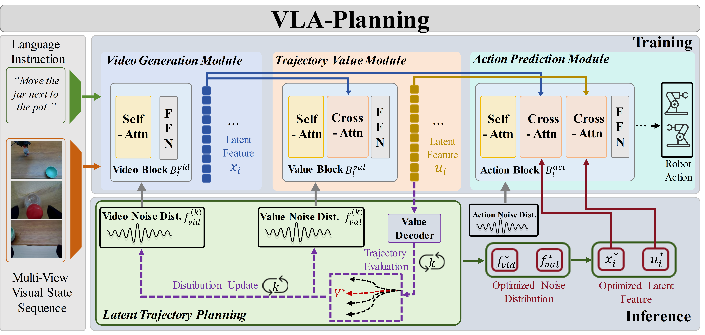
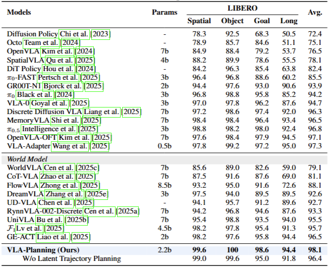
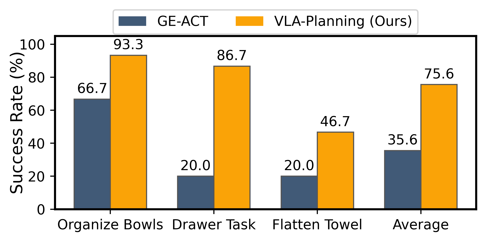

# VLA-Planning: World-Model Predictive Control for Vision-Language-Action Models

<div id="top" align="center">



<a href='NeurIPS_2026_model_based.pdf'></a> &nbsp;


</div>

This repository contains the implementation of **VLA-Planning**, a world-model-based  framework. The central idea is to unify **instruction-conditioned video prediction**, **trajectory value estimation**, **action decoding**, and **latent trajectory planning** within a single multi-view diffusion transformer for long-horizon robotic manipulation.

Instead of planning directly in action space, VLA-Planning performs iterative inference in a compact latent trajectory space. This design biases sampling toward feasible futures, allows trajectory-level evaluation before action execution, and improves long-horizon decision making in both simulated and real-world settings.


## Highlights

- A unified multi-view transformer backbone with **video**, **value**, and **action** experts.
- A **three-stage training recipe**: task-specific video adaptation, trajectory value learning, and action post-training.
- **Latent trajectory planning** at inference time through iterative elite reweighting in latent space.
- Support for **LIBERO closed-loop evaluation**, open-loop validation, and **real-world deployment**.
## TODO
- [x] Release inference & training code
- [] Release model weights

## Method Overview

### Motivation

Direct action prediction is often insufficient for long-horizon embodied tasks because it provides limited trajectory-level reasoning. VLA-Planning addresses this by first imagining future visual trajectories, then evaluating their long-horizon quality, and finally decoding executable robot actions from optimized trajectory features.

The current paper motivates this design from a model-based planning perspective:

- direct action-space planning suffers from vanishing feasible mass as the horizon grows;
- latent planning reweights probability mass toward feasible trajectories;
- iterative latent inference is necessary to concentrate samples on high-value futures.


### Architecture

VLA-Planning decomposes planning and control into three tightly coupled modules:

1. **Instruction-conditioned video generation.**
   A multi-view diffusion transformer predicts future visual trajectories conditioned on history frames and language instructions.

2. **Trajectory value estimation.**
   A value expert evaluates candidate futures and provides the trajectory-level signal used for latent planning.

3. **Action decoding.**
   An action expert predicts executable action chunks from optimized video and value features, optionally conditioned on robot state.


## Main Results

### LIBERO Benchmark

<div align="center">
  
</div>

### Real-World Evaluation

<div align="center">
  
</div>


## Getting Started

### Setup

```bash
git clone https://github.com/Win-commit/VLA-Planning.git
cd VLA-Planning

conda create -n vla_planning python=3.10.4
conda activate vla_planning
pip install -r requirements.txt
```


### Required Checkpoints

Please download the following pretrained weights before training or inference:

1. `LTX_video_part`
   - [tokenizer](https://huggingface.co/Lightricks/LTX-Video/tree/main/tokenizer)
   - [text_encoder](https://huggingface.co/Lightricks/LTX-Video/tree/main/text_encoder)
   - [VAE](https://huggingface.co/Lightricks/LTX-Video/tree/main/vae)
   - [model_index.json](https://huggingface.co/Lightricks/LTX-Video/blob/main/model_index.json)

2. `GE_base`
   - [GE-Base-fast](https://huggingface.co/agibot-world/Genie-Envisioner/tree/main)

After downloading the checkpoints, please update the corresponding paths in your config file:

```
pretrained_model_name_or_path: PATH/TO/LTX_video_part
diffusion_model:
model_path: PATH/TO/GE_base_fast.safetensors
```


### Dataset Format

This codebase uses a **LeRobot-like** layout. A typical dataset is organized as:

```text
ROOT_PATH/
└── DATASETNAME/
    ├── data/
    │   └── chunk-000/
    │       ├── episode_000000.parquet
    │       └── ...
    ├── meta/
    │   ├── episodes.jsonl
    │   ├── tasks.jsonl
    │   ├── info.json
    │   
    └── videos/
        └── chunk-000/
            ├── CAMERA_A/
            │   ├── episode_000000.mp4
            │   └── ...
            └── CAMERA_B/
                ├── episode_000000.mp4
                └── ...
```


### Action / State Statistics

We provide `scripts/get_statistics.py` to compute normalization statistics:

```bash
python scripts/get_statistics.py \
  --data_root PATH/TO/YOUR/DATASET/data/ \
  --data_name DATASETNAME \
  --data_type eef \
  --action_key actions \
  --state_key state \
  --value_key state_value \
  --save_path PATH/TO/YOUR/DATASET/meta/stats.jsonl
```
After running the script, you can get a jsonl file of statistics. You should specific the path of json file in configs
```
data:
	train:
        ...
        stat_file: PATH/OF/FILE.jsonl
     val:
         ...
         stat_file: PATH/OF/FILE.jsonl
```

## Training

### 1. Video Adaptation
For the unseen robots or customized new tasks, we recommend performing this step of video adaptation to achieve better performance.

i. Modify the config in ``configs/ltx_model/*/video_model.yaml``. More details of dataset can be found in data/*_dataset.py:
```
    data:
        train / val:
            data_roots:   [ROOT_PATH_TO_YOUR_DATASETS, ]
            domains:      [DATASETNAME, ]
            # rewrite to the camera names used in your dataset
            valid_cam:    ["observation.images.top_head", "observation.images.hand_left", "observation.images.hand_right"]
            ...
```

ii. Disable value-model and action-model as bellow in `configs/ltx_model/*/video_model.yaml`:
```
return_video: True
return_value:False
return_action: False
train_mode: 'video_only'
diffusion_model:
	config:
		value_expert: False
		action_expert: False
```
iii. Run
```
    bash scripts/train.sh main.py configs/ltx_model/*/video_model.yaml
```


### 2. Trajectory Value Learning

i. Modify the config in `configs/ltx_model/*/value_model.yaml`
```
    diffusion_model:
        model_path: PATH_TO_VIDEO_POST_TRAINING_CHECKPOINT_SAFETENSOR
    data:
        train / val:
            data_roots:   [ROOT_PATH_TO_YOUR_DATASETS, ]
            domains:      [DATASETNAME, ]
            # rewrite to the camera names used in your dataset
            valid_cam:    ["observation.images.top_head", "observation.images.hand_left", "observation.images.hand_right"]
            # rewrite to the keys used in your dataset
            value_key: "state_value"
            value_dense: True
            ...
```
More details of dataset can be found in data/*_dataset.py

ii. Enable value-model as bellow in `configs/ltx_model/*/value_model.yaml`:
```
return_video: False
return_value:True
return_action: False
train_mode: 'value_only'
diffusion_model:
     config:
        value_expert: True
        action_expert: False
noisy_video: True
```

iii. Run
```
bash scripts/train.sh main.py configs/ltx_model/*/value_model.yaml
```


### 3. Action Post-Training

i. Modify the config in ``configs/ltx_model/*/policy_model.yaml``
```
diffusion_model:
    model_path: PATH_TO_VALUE_POST_TRAINING_CHECKPOINT_SAFETENSOR
    data:
        train / val:
            data_roots:   [ROOT_PATH_TO_YOUR_DATASETS, ]
            domains:      [DATASETNAME, ]
            # rewrite to the camera names used in your dataset
            valid_cam:    ["observation.images.top_head", "observation.images.hand_left", "observation.images.hand_right"]
            # rewrite to the keys used in your dataset
            action_key:   "action"
            state_key:    "observation.state" 
            action_type:  "absolute"  # "absolute", "delta" or "relative"
            action_space: "joint"
            ...
```
More details of dataset can be found in data/*_dataset.py

ii. Enable action-model as bellow in `configs/ltx_model/*/policy_model.yaml`:
```
return_video: False
return_value: True
return_action: True
train_mode: 'action_full'
diffusion_model:
     config:
     	value_expert: True
        action_expert: True
noisy_video: True
```

iii. Run
```
    bash scripts/train.sh main.py configs/ltx_model/*/policy_model.yaml
```


## Evaluation

### Open-Loop Validation

```bash
bash scripts/infer.sh \
  main.py \
  PATH/TO/CONFIG \
  PATH/TO/CHECKPOINT \
  PATH/TO/OUTPUTS \
  DomainName
```

This path is useful for quick qualitative inspection and open-loop video/value/action prediction.


## Real-World Deployment

We provide both WebSocket-based serving and HTTP-based robot deployment.


### WebSocket Server

```bash
python3 web_infer_scripts/main_server.py \
  -c PATH/TO/CONFIG \
  -w PATH/TO/CHECKPOINT \
  --host 0.0.0.0 \
  --port $PORT \
  --domain_name $DOMAIN_NAME \
  --action_dim $ACTION_DIM \
  --norm_type $NORM_TYPE \
  --device 0
```

A minimal test client is available in `web_infer_scripts/simple_client.py`.


### HTTP Server for Robot Deployment

```bash
python3 web_infer_utils/Real_deploy.py \
  -c PATH/TO/CONFIG \
  -w PATH/TO/CHECKPOINT \
  --host 0.0.0.0 \
  --port $PORT \
  --domain_name $DOMAIN_NAME \
  --action_dim $ACTION_DIM \
  --norm_type $NORM_TYPE \
  --device 0
```


## Acknowledgement

This codebase builds on the current [`Genie-Envisioner`](https://github.com/AgibotTech/Genie-Envisioner/tree/master) implementation.


## Citation

If you find this project useful, please consider citing the paper once the public version is released.
